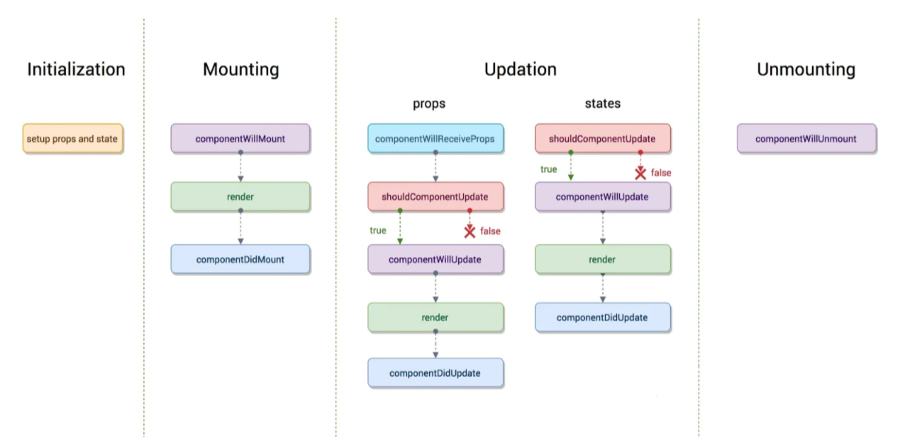
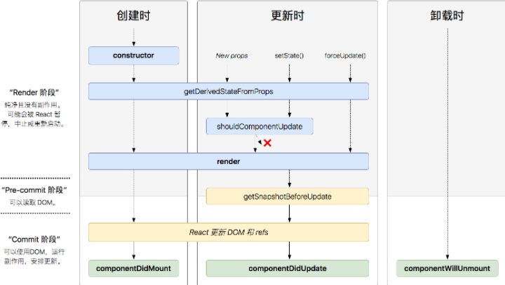

# react

## 1、什么是 React，对它的理解
React 是一个用于构建用户界面的 JavaScript 库，由 Facebook 开发和维护。它采用组件化的方式构建 UI，使得开发者能够更高效地创建复杂、动态的 Web 应用程序。
::: details 详情
React 的核心思想是组件化，组件是可复用的、可组合的 UI 元素，它们通过 `props` 传递数据，并使用 `state` 进行状态管理。React 使用`虚拟 DOM`（Virtual DOM）来优化性能，它将 UI 渲染为虚拟 DOM，然后进行比较，以确定需要更新的部分，最后更新到`真实 DOM`。

React 的核心概念包括：
- 组件：React 的核心概念，用于构建用户界面的代码片段，可以包含 HTML、CSS、JavaScript 等内容。
- JSX：`JSX` 是 React 的语法扩展，允许在 JavaScript 中编写类似 HTML 的代码。它使得 UI 的描述更加直观和简洁。
- 虚拟 DOM：React 使用虚拟 DOM 来提高性能。虚拟 DOM 是实际 DOM 的轻量级副本，React 通过比较虚拟 DOM 的变化，最小化对实际 DOM 的操作，从而提升渲染效率。
- 单向数据流：React 遵循`单向数据流`的原则，数据从父组件传递到子组件，子组件通过回调函数将数据变化通知父组件。这种方式使得数据流动更加清晰和可控。

React 的主要特性包括：
- 声明式编程：React 是声明式的，开发者只需描述 UI 应该是什么样子，而不需要关心如何更新 DOM。React 会自动处理 DOM 的更新。
- 组件化开发：React 的组件化设计使得代码更易于维护、复用和测试。每个组件可以独立开发和测试，降低了代码的耦合度。
- 状态管理：React 提供了状态管理机制，组件可以修改 `state`，并触发重新渲染。
- 生命周期方法：React 组件有生命周期方法（如 `componentDidMount`、`componentDidUpdate` 等），用于在组件的不同阶段执行特定逻辑。在函数组件中，这些逻辑可以通过 `useEffect` Hook 实现。
- 生态丰富：React 拥有庞大的生态系统，包括 `React-Router`（路由）、`Redux`（状态管理）、`Next.js`（服务器端渲染）等工具和库，帮助开发者构建完整的应用。

React 的优势：
- 高效性能：虚拟 DOM 和高效的 Diff 算法使得 React 在处理复杂 UI 时性能优异。
- ​开发效率高：组件化和声明式编程使得代码更易于开发和维护。
- ​社区支持强大：React 拥有庞大的开发者社区，提供了丰富的工具、库和教程。
- ​跨平台能力：通过 React Native，React 可以用于开发移动端应用，实现代码复用。
:::

## 2、React 的生命周期
React 组件的生命周期在过去的不同版本中有所调整，以下是 React 类组件的经典生命周期钩子（React v16及之前版本）和现代函数组件使用的Hook形式生命周期方法的对比表：
::: details 详情
**类组件生命周期方法（经典生命周期）：**
|阶段|生命周期钩子|描述|
|----|-------|-------|
|初始化/挂载|`constructor(props)`|构造函数，在组件实例化时调用，用于设置初始状态或绑定实例方法|
|挂载前/实例化后|`static getDerivedStateFromProps(props, state)`|（可选）在每次渲染前调用，返回新的 state 以响应 props 更改，但不推荐过度依赖此方法|
|挂载前|`render()`|必须定义的方法，用于返回 jsx 元素，React 根据此方法渲染 DOM|
|挂载后|`componentDidMount()`|组件挂载到 DOM 后调用，常用于网络请求、订阅或手动操作 DOM|
|更新前|`shouldComponentUpdate(nextProps, nextState)`|（可选）在 props 或 state 即将更改时调用，返回布尔值决定是否重新渲染|
|更新前|`static getSnapshotBeforeUpdate(prevProps, prevState)`|在最新的渲染被提交到 DOM 之前获取一些信息，返回值将在 componentDidUpdate 中作为第三个参数|
|更新|`render()`|（同上）在 props 或 state 更改时再次调用|
|更新后|`componentDidUpdate(prevProps, prevState, snapshot)`|组件完成更新并重新渲染到 DOM 后调用|
|卸载前|`componentWillUnmount()`|组件从 DOM 移除之前调用，用于清理工作如取消定时器、解绑事件监听器等|



**函数组件生命周期钩子（使用React Hooks）：**
|阶段|Hook 方法|描述|
|----|-------|-------|
|初始化/挂载|`useState()`|初始化状态并在每次渲染时返回一对值（当前状态和更新状态的函数）|
|初始化/挂载|`useEffect(fn, deps)`|类似于 `componentDidMount` 和 `componentDidUpdate` 的合并，以及 `componentWillUnmount` 功能；fn 函数在组件渲染后运行，deps 是依赖数组，控制何时重新运行该效果|
|初始化/挂载|`useLayoutEffect(fn, deps)`|类似 `useEffect`，但在所有 DOM 变更之后同步调用|
|初始化/挂载|`useMemo(() => result, deps)`|记忆化计算结果，仅当依赖项 deps 改变时重新计算|
|初始化/挂载|`useCallback(fn, deps)`|记忆化函数引用，避免不必要的函数重创建|
|卸载|`useCleanup(returnFn)`|返回的函数在组件卸载时执行，用于资源清理|


:::

## 3、React 如何捕获错误
::: details 详情
- 错误边界（Error Boundaries）
  - React 16及更高版本引入了错误边界这一概念，它是一种特殊的 React 组件，能够在其子组件树中捕获任何渲染错误或其他 JavaScript 错误。当错误边界内的任何子组件抛出错误时，错误边界能够捕获这个错误，记录日志，并且可以选择性地显示恢复界面，而不是让整个应用程序崩溃。
  - 错误边界不会捕获以下情况的错误：
    > - 事件处理器中的错误。
    > - 异步代码（如 setTimeout 或 Promise）中的错误。
    > - 服务端渲染中的错误。
    > - 错误边界自身抛出的错误。
  ```js
  import React from 'react';

  // 定义错误边界组件
  class ErrorBoundary extends React.Component {
    constructor(props) {
      super(props);
      this.state = { hasError: false };
    }

    static getDerivedStateFromError(error) {
      // 更新 state 以显示降级 UI
      return { hasError: true };
    }

    componentDidCatch(error, errorInfo) {
      // 可以在这里记录错误日志
      console.error("捕获到错误:", error, errorInfo);
    }

    render() {
      if (this.state.hasError) {
        // 渲染降级 UI
        return <h1>发生错误，请稍后再试。</h1>;
      }

      return this.props.children;
    }
  }

  // 使用错误边界
  function ErrorProneComponent() {
    throw new Error("这是一个测试错误");
  }

  export default function App() {
    return (
      <ErrorBoundary>
        <ErrorProneComponent />
      </ErrorBoundary>
    );
  }
  ```
- window.onerror
  ```js
  window.onerror = function (message, source, lineno, colno, error) {
  console.error("捕获到全局错误:");
  console.log("错误信息:", message);
  console.log("错误来源:", source);
  console.log("行号:", lineno, "列号:", colno);
  console.log("错误对象:", error);
  };
  ```
- unhandledrejection
  ```js
  window.addEventListener("unhandledrejection", function (event) {
  console.error("捕获到未处理的 Promise 错误:");
  console.log("原因:", event.reason);
  });
  ```
:::

## 4、React 组件通讯方式
::: details 详情
- 通过 props 向子组件传递数据
```js
//父组件
const Parent = () => {
  const message = 'Hello from Parent'
  return <Child message={message} />
}

// 子组件
const Child = ({ message }) => {
  return <div>{message}</div>
}
```
- 通过回调函数向父组件传递数据
```js
//父组件
const Parent = () => {
  const handleData = (data) => {
    console.log('Data from Child:', data)
  }
  return <Child onSendData={handleData} />
}

// 子组件
const Child = ({ message }) => {
  return <button onClick={() => onSendData('Hello from Child')}>Send Data</button>
}
```
- 使用refs调用子组件暴露的方法
```js
import React, { useRef, forwardRef, useImperativeHandle } from 'react'

// 子组件
const Child = forwardRef((props, ref) => {
  // 暴露方法给父组件
  useImperativeHandle(ref, () => ({
    sayHello() {
      alert('Hello from Child Component!')
    },
  }))

  return <div>Child Component</div>
})

// 父组件
function Parent() {
  const childRef = useRef(null)

  const handleClick = () => {
    if (childRef.current) {
      childRef.current.sayHello()
    }
  }

  return (
    <div>
      <Child ref={childRef} />
      <button onClick={handleClick}>Call Child Method</button>
    </div>
  )
}

export default Parent
```
- 通过 Context 进行跨组件通信
```js
import React, { useState } from 'react'

// 创建一个 Context
const MyContext = React.createContext()

// 父组件
function Parent() {
  const [sharedData, setSharedData] = useState('Hello from Context')

  const updateData = () => {
    setSharedData('Updated Data from Context')
  }

  return (
    // 提供数据和更新函数
    <MyContext.Provider value={{ sharedData, updateData }}>
      <ChildA />
    </MyContext.Provider>
  )
}

// 子组件 A（引用子组件 B）
function ChildA() {
  return (
    <div>
      <ChildB />
    </div>
  )
}

// 子组件 B（使用 useContext）
function ChildB() {
  const { sharedData, updateData } = React.useContext(MyContext)
  return (
    <div>
      <div>ChildB: {sharedData}</div>
      <button onClick={updateData}>Update Data</button>
    </div>
  )
}

export default Parent
```
- 使用状态管理库进行通信
  - React Context + useReducer
  ```js
  import React, { useReducer } from 'react'

  const initialState = { count: 0 }

  function reducer(state, action) {
    switch (action.type) {
      case 'increment':
        return { count: state.count + 1 }
      case 'decrement':
        return { count: state.count - 1 }
      default:
        throw new Error()
    }
  }

  const CounterContext = React.createContext()

  function CounterProvider({ children }) {
    const [state, dispatch] = useReducer(reducer, initialState)
    return <CounterContext.Provider value={{ state, dispatch }}>{children}</CounterContext.Provider>
  }

  function Counter() {
    const { state, dispatch } = React.useContext(CounterContext)
    return (
      <div>
        Count: {state.count}
        <button onClick={() => dispatch({ type: 'increment' })}>+</button>
        <button onClick={() => dispatch({ type: 'decrement' })}>-</button>
      </div>
    )
  }

  function App() {
    return (
      <CounterProvider>
        <Counter />
      </CounterProvider>
    )
  }

  export default App
  ```
  - Redux：使用 Redux Toolkit 简化 Redux 开发
  ```js
  import { createSlice, configureStore } from '@reduxjs/toolkit'

  const counterSlice = createSlice({
    name: 'counter',
    initialState: { value: 0 },
    reducers: {
      increment: (state) => {
        state.value += 1
      },
      decrement: (state) => {
        state.value -= 1
      },
    },
  })

  const { increment, decrement } = counterSlice.actions

  const store = configureStore({
    reducer: counterSlice.reducer,
  })

  store.subscribe(() => console.log(store.getState()))

  store.dispatch(increment())
  store.dispatch(decrement())
  ```
  - MobX
  ```js
  import { makeAutoObservable } from 'mobx'
  import { observer } from 'mobx-react-lite'

  class CounterStore {
    count = 0

    constructor() {
      makeAutoObservable(this)
    }

    increment() {
      this.count += 1
    }

    decrement() {
      this.count -= 1
    }
  }

  const counterStore = new CounterStore()

  const Counter = observer(() => {
    return (
      <div>
        Count: {counterStore.count}
        <button onClick={() => counterStore.increment()}>+</button>
        <button onClick={() => counterStore.decrement()}>-</button>
      </div>
    )
  })

  export default Counter
  ```
  - Zustand
  ```js
  import create from "zustand";

  const useStore = create((set) => ({
    count: 0,
    increment: () => set((state) => ({ count: state.count + 1 })),
    decrement: () => set((state) => ({ count: state.count - 1 })),
  }));

  function Counter() {
    const { count, increment, decrement } = useStore();
    return (
      <div>
        Count: {count}
        <button onClick={increment}>+</button>
        <button onClick={decrement}>-</button>
      </div>
    );
  }

  export default Counter;
  ```
- 使用事件总线（Event Bus）进行通信
  > 可以使用第三方库如 pubsub-js 来实现父子组件间通信。在父组件中订阅一个事件，子组件在特定情况下发布这个事件并传递数据。
```js
import React from 'react'
import PubSub from 'pubsub-js'

const ParentComponent = () => {
  React.useEffect(() => {
    const token = PubSub.subscribe('childData', (msg, data) => {
      console.log('Received data from child:', data)
    })
    return () => {
      PubSub.unsubscribe(token)
    }
  }, [])

  return <ChildComponent />
}

const ChildComponent = () => {
  const sendData = () => {
    PubSub.publish('childData', { message: 'Hello from child' })
  }

  return <button onClick={sendData}>Send data from child</button>
}

export default ParentComponent
```
:::

## 5、state 和 props 有什么区别
在 React 中，`state`和 `props` 都用于管理组件的数据和状态。
::: details 详情
- State（状态）
  > state 是组件内部的数据，用于管理组件的状态和变化。 `state 是可变的`，组件可以通过 setState 方法来更新和修改 state。 state 是在组件的构造函数中初始化的，通常被定义为组件的类属性。 state 的值可以由组件自身内部改变，通过调用 setState 方法触发组件的重新渲染。 当组件的 state 发生变化时，组件会重新渲染。
- Props（属性）
  > props 是组件之间传递数据的一种方式，用于从父组件向子组件传递数据。 `props 是只读的`，即父组件传递给子组件的数据在子组件中不能被修改。 props 是在组件的声明中定义，通过组件的属性传递给子组件。 props 的值由父组件决定，子组件无法直接改变它的值。 当父组件的 props 发生变化时，子组件会重新渲染。

总结
|特性|State|Props|
|---|------|------|
|​来源|组件内部定义|父组件传递给子组件|
|​可变性|可变，通过 `setState` 或 `useState` 更新|不可变，子组件只能读取|
|​用途|存储组件的内部状态|传递数据和配置信息给子组件|
|​更新机制|修改 `state` 会触发组件重新渲染|父组件更新 `props` 会触发子组件重新渲染|
|​共享范围|私有，仅限组件内部使用|共享，父子组件之间传递|
:::

## 6、React 有哪些内置 Hooks 
- 状态管理 Hooks
::: details 详情
- `useState`
  > 用于在函数组件中添加局部状态。
  ```js
  import React, { useState } from "react";

  function Counter() {
    const [count, setCount] = useState(0); // 初始化状态为 0

    return (
      <div>
        <p>Count: {count}</p>
        <button onClick={() => setCount(count + 1)}>Increment</button>
      </div>
    );
  }
  ```
- `useReducer`
  > 用于管理复杂的状态逻辑，类似于 Redux 的 reducer。
  ```js
  import React, { useReducer } from "react";

  function counterReducer(state, action) {
    switch (action.type) {
      case "increment":
        return { count: state.count + 1 };
      case "decrement":
        return { count: state.count - 1 };
      default:
        throw new Error();
    }
  }

  function Counter() {
    const [state, dispatch] = useReducer(counterReducer, { count: 0 });

    return (
      <div>
        <p>Count: {state.count}</p>
        <button onClick={() => dispatch({ type: "increment" })}>Increment</button>
        <button onClick={() => dispatch({ type: "decrement" })}>Decrement</button>
      </div>
    );
  }
  ```
:::
- 副作用 Hooks
::: details 详情
- `useEffect`
  > 用于在函数组件中执行副作用操作（如数据获取、订阅、手动 DOM 操作等）。
  ```js
  import React, { useState, useEffect } from "react";

  function Example() {
    const [count, setCount] = useState(0);

    useEffect(() => {
      document.title = `You clicked ${count} times`; // 更新文档标题
      return () => {
        console.log("Component unmounted or count changed");
      }; // 清理函数
    }, [count]); // 仅在 count 变化时执行

    return <button onClick={() => setCount(count + 1)}>Click me</button>;
  }
  ```
- `useLayoutEffect`
  > 与 useEffect 类似，但在 DOM 更新后同步执行，适用于需要直接操作 DOM 的场景。
  ```js
  import React, { useLayoutEffect, useRef, useState } from "react";

  function App() {
    const divRef = useRef(null);
    const [width, setWidth] = useState(0);

    useLayoutEffect(() => {
      if (divRef.current) {
        setWidth(divRef.current.offsetWidth); // 同步获取 DOM 宽度
      }
    }, []);

    return <div ref={divRef}>Width: {width}px</div>;
  }
  ```
:::
- 上下文 Hooks
::: details 详情
- `useContext`
  > 用于在函数组件中访问 React 上下文（Context）。
  ```js
  import React, { createContext, useContext } from "react";

  const ThemeContext = createContext("light"); // 创建 Context

  function App() {
    return (
      <ThemeContext.Provider value="dark">
        <Toolbar />
      </ThemeContext.Provider>
    );
  }

  function Toolbar() {
    const theme = useContext(ThemeContext); // 使用 useContext 访问 Context
    return <p>Current theme: {theme}</p>;
  }
  ```
:::
- 引用 Hooks
::: details 详情
- `useRef`
  > 用于在函数组件中获取一个可变的引用对象，通常用于访问 DOM 元素或存储可变值。
  ```js
  import React, { useRef } from "react";

  function TextInput() {
    const inputRef = useRef(null); // 创建一个 ref

    const focusInput = () => {
      inputRef.current.focus(); // 访问 DOM 元素
    };

    return (
      <div>
        <input ref={inputRef} type="text" />
        <button onClick={focusInput}>Focus Input</button>
      </div>
    );
  }
  ```
:::
- 性能优化 Hooks
::: details 详情
- `useMemo`
  > 用于缓存计算结果，避免重复计算。
  ```js
  import React, { useState, useMemo } from "react";

  function App() {
    const [count, setCount] = useState(0);
    const [text, setText] = useState("");

    const expensiveCalculation = useMemo(() => {
      console.log("Calculating...");
      return count * 2; // 仅在 count 变化时重新计算
    }, [count]);

    return (
      <div>
        <button onClick={() => setCount(count + 1)}>Increment</button>
        <input value={text} onChange={(e) => setText(e.target.value)} />
        <p>Result: {expensiveCalculation}</p>
      </div>
    );
  }
  ```
- `useCallback`
  > 用于缓存函数，避免重复创建。
  ```js
  import React, { useState, useCallback } from "react";

  function App() {
    const [count, setCount] = useState(0);
    const [text, setText] = useState("");

    const handleClick = useCallback(() => {
      console.log("Button clicked");
    }, []); // 仅在组件首次渲染时创建

    return (
      <div>
        <button onClick={handleClick}>Click me</button>
        <input value={text} onChange={(e) => setText(e.target.value)} />
        <p>Count: {count}</p>
      </div>
    );
  }
  ```
:::
- 其他 Hooks
::: details 详情
- `useDeferredValue`
  > 延迟更新 UI 的某些部分，适用于处理高优先级和低优先级的更新。
  ```js
  import React, { useState, useDeferredValue } from "react";

  function App() {
    const [input, setInput] = useState("");
    const deferredInput = useDeferredValue(input); // 延迟更新

    return (
      <div>
        <input
          type="text"
          value={input}
          onChange={(e) => setInput(e.target.value)}
          placeholder="Type something..."
        />
        <p>Low priority: {deferredInput}</p> {/* 延迟显示输入内容 */}
      </div>
    );
  }
  ```
- `useActionState`
  > 根据某个表单动作的结果更新状态，通常用于处理表单提交的中间状态。
  ```js
  import React, { useState } from "react";

  function App() {
    const [isSubmitting, setIsSubmitting] = useState(false);
    const [formData, setFormData] = useState({ username: "", password: "" });

    const handleSubmit = async (state, formData) => {
      setIsSubmitting(true);
      try {
        // 模拟异步提交
        await new Promise((resolve) => setTimeout(resolve, 2000));
        return { success: true }; // 提交成功
      } catch (error) {
        return { success: false }; // 提交失败
      } finally {
        setIsSubmitting(false);
      }
    };

    const actionState = handleSubmit(isSubmitting, formData);

    return (
      <form>
        <input
          type="text"
          placeholder="Username"
          value={formData.username}
          onChange={(e) => setFormData({ ...formData, username: e.target.value })}
        />
        <input
          type="password"
          placeholder="Password"
          value={formData.password}
          onChange={(e) => setFormData({ ...formData, password: e.target.value })}
        />
        <button type="submit" disabled={isSubmitting}>
          {isSubmitting ? "Submitting..." : "Submit"}
        </button>
        {actionState?.success === false && <p>Submission failed!</p>}
      </form>
    );
  }
  ```
- `useImperativeHandle`
  > 自定义暴露给父组件的实例值，通常与 `forwardRef` 一起使用。
  ```js
  import React, { useRef, useImperativeHandle, forwardRef } from "react";

  const Input = forwardRef((props, ref) => {
    const inputRef = useRef();

    useImperativeHandle(ref, () => ({
      focusInput: () => {
        inputRef.current.focus();
      },
      getValue: () => {
        return inputRef.current.value;
      },
    }));

    return <input ref={inputRef} {...props} />;
  });

  function App() {
    const inputRef = useRef();

    const focusHandler = () => {
      inputRef.current.focusInput(); // 调用子组件暴露的方法
    };

    const getValueHandler = () => {
      alert(inputRef.current.getValue()); // 获取子组件的值
    };

    return (
      <div>
        <Input placeholder="Type something..." />
        <button onClick={focusHandler}>Focus Input</button>
        <button onClick={getValueHandler}>Get Value</button>
      </div>
    );
  }
  ```
- `useDebugValue`
  > 用于在 React Developer Tools 中显示自定义调试值。
  ```js
  import { useDebugValue, useState } from "react";

  function useCustomHook() {
    const [value, setValue] = useState(0);
    useDebugValue(value > 0 ? "Positive" : "Non-positive"); // 在 DevTools 中显示标签
    return [value, setValue];
  }

  function App() {
    const [value, setValue] = useCustomHook();

    return (
      <div>
        <button onClick={() => setValue(value + 1)}>Increment</button>
        <p>Value: {value}</p>
      </div>
    );
  }
  ```
- `useOptimistic`
  > 帮助你更乐观地更新用户界面，假设操作会成功，并在失败时回滚。
  ```js
  import React, { useState } from "react";
  import { useOptimistic } from "react";

  function App() {
    const [count, setCount] = useState(0);
    const [increment, setIncrement] = useOptimistic(setCount, (newCount) => newCount + 1);

    const handleClick = () => {
      increment(); // 乐观更新
      setTimeout(() => {
        setCount(count + 1); // 实际更新
      }, 1000);
    };

    return (
      <div>
        <p>Count: {count}</p>
        <button onClick={handleClick}>Increment</button>
      </div>
    );
  }
  ```
- `useTransition`
  > 用于标记某些状态更新为“过渡”状态，允许你在更新期间显示加载指示器。
  ```js
  import React, { useState, useTransition } from "react";

  function App() {
    const [isPending, startTransition] = useTransition();
    const [count, setCount] = useState(0);
    const [input, setInput] = useState("");

    const handleClick = () => {
      startTransition(() => {
        setCount(count + 1); // 标记为过渡更新
      });
    };

    const handleInputChange = (e) => {
      setInput(e.target.value); // 高优先级更新
    };

    return (
      <div>
        {isPending ? <p>Updating...</p> : <p>Count: {count}</p>}
        <button onClick={handleClick}>Increment</button>
        <input type="text" value={input} onChange={handleInputChange} />
      </div>
    );
  }
  ```
- `useId`
  > 用于生成唯一的 ID，可以生成传递给无障碍属性的唯一 ID。
  ```js
  import React, { useId } from "react";

  function App() {
    const inputId = useId();

    return (
      <div>
        <label htmlFor={inputId}>Username:</label>
        <input id={inputId} type="text" placeholder="Enter your username" />
      </div>
    );
  }
  ```
- `useSyncExternalStore`
  > 用于订阅外部存储（如 Redux 或 Zustand）的状态。
  ```js
  import React, { useSyncExternalStore } from "react";

  // 模拟外部存储
  const externalStore = {
    subscribe: (callback) => {
      window.addEventListener("storage", callback);
      return () => window.removeEventListener("storage", callback);
    },
    getSnapshot: () => localStorage.getItem("key") || "default",
  };

  function App() {
    const value = useSyncExternalStore(externalStore.subscribe, externalStore.getSnapshot);

    return <p>External Store Value: {value}</p>;
  }
  ```
- `useInsertionEffect`
  > 为 CSS-in-JS 库的作者特意打造的，在布局副作用触发之前将元素插入到 DOM 中。
  ```js
  import React, { useInsertionEffect, useState } from "react";

  function App() {
    const [style, setStyle] = useState({ color: "black" });

    useInsertionEffect(() => {
      const styleElement = document.createElement("style");
      styleElement.textContent = `
        .dynamic-style {
          font-weight: bold;
        }
      `;
      document.head.appendChild(styleElement);
      return () => document.head.removeChild(styleElement);
    }, []);

    return (
      <div>
        <p className="dynamic-style" style={style}>
          This text has dynamic styles.
        </p>
        <button onClick={() => setStyle({ color: "red" })}>Change Color</button>
      </div>
    );
  }
  ```
:::